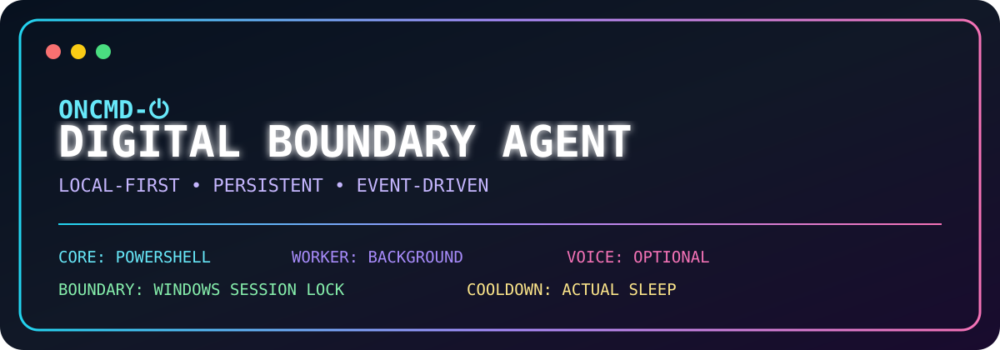

# OnCmd-⏻

<p align="center">
  
</p>

```text
  +==========================================================================+
  |                                                                          |
  |                         O N C M D - [POWER]                             |
  |                                                                          |
  |                    DIGITAL BOUNDARY AGENT                              |
  |                                                                          |
  +==========================================================================+

                  ██████╗ ███╗   ██╗ ██████╗███╗   ███╗██████╗
                 ██╔═══██╗████╗  ██║██╔════╝████╗ ████║██╔══██╗
                 ██║   ██║██╔██╗ ██║██║     ██╔████╔██║██║  ██║
                 ██║   ██║██║╚██╗██║██║     ██║╚██╔╝██║██║  ██║
                 ╚██████╔╝██║ ╚████║╚██████╗██║ ╚═╝ ██║██████╔╝

                            +------------+
                            |     [ ]    |
                            |      |     |
                            |    [   ]   |
                            +------------+

                  D I G I T A L   B O U N D A R Y
                            A G E N T

       +------------------------------------------------------------+
       | CORE       ● POWERSHELL                                   |
       | WORKER     ● BACKGROUND                                   |
       | BOUNDARY   ● WINDOWS SESSION LOCK                       |
       | COOLDOWN   ● WAIT FOR ACTUAL SLEEP                      |
       | STORAGE    ● LOCAL PERSISTENCE                           |
       +------------------------------------------------------------+

         ◆ LOCAL-FIRST    ◆ PERSISTENT    ◆ EVENT-DRIVEN
```

**Local-first Windows digital boundary agent.**

OnCmd is a PowerShell-based Windows automation project built around a simple idea: enforce a user-defined digital cutoff without depending on a cloud service.

## 🎨 Project Art

OnCmd has a dedicated colorful terminal-inspired project banner in [`assets/oncmd-art.svg`](assets/oncmd-art.svg). Art is an important part of the project because its creator has a genuine passion for art and enjoys bringing that creative side into technical projects. The goal is for OnCmd to feel both engineered and expressive—not just functional code in a folder.

The artwork highlights the main architecture:

- **Core** — PowerShell
- **Worker** — Background enforcement
- **Boundary** — Windows session lock
- **Cooldown** — Actual Windows sleep detection/reset behavior
- **Voice** — Optional local voice control

## Current architecture

- **Core** — PowerShell command/control layer
- **Worker** — background enforcement
- **Boundary** — Windows session lock at cutoff
- **Cooldown** — waits for an actual Windows sleep cycle before resetting
- **Storage** — persistent local JSON state and event logs
- **Learning** — records cutoff history so OnCmd can eventually suggest the user's usual time
- **Voice** — optional local Windows speech recognition worker

## Repository layout

```text
OnCmd/
├── README.md
├── LICENSE
├── .gitignore
├── install.ps1
├── assets/
│   └── oncmd-art.svg
├── src/
│   ├── OnCmd.ps1
│   ├── OnCmd.Worker.ps1
│   ├── OnCmd.Learning.ps1
│   └── OnCmd.VoiceWorker.ps1
└── config/
    └── config.example.json
```

The repository contains the **program and installer logic**. Runtime state is intentionally kept under `%LOCALAPPDATA%\OnCmd` and is not committed to GitHub.

## Design principles

- Local-first
- Persistent
- Event-driven
- PowerShell-native
- No AI API required for core operation
- Optional local voice control
- No credential handling
- No authentication bypass
- No keyboard/mouse interception

## Voice

Voice is optional and disabled by default. When enabled, OnCmd uses Windows `System.Speech` recognition and a Scheduled Task so the listener can run independently of an open PowerShell terminal.

Example commands:

```text
OnCmd, status
OnCmd, what's my usual cutoff?
OnCmd, set my cutoff for 9:15 PM
OnCmd, cancel my schedule
```

Schedule-changing voice commands should require confirmation before being applied.

## Runtime data

OnCmd keeps mutable runtime data outside the repository:

```text
%LOCALAPPDATA%\OnCmd\
├── state.json
├── config.json
├── events.log
├── oncmd.log
└── bin\
```

This keeps personal schedules, history, and machine-specific state out of source control.

## Status

Early development. The first goal is to preserve the proven local Windows cutoff behavior while building a clean, reproducible installation path and optional voice/learning layers around it.
